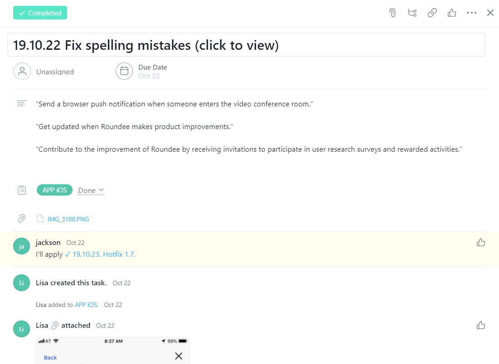
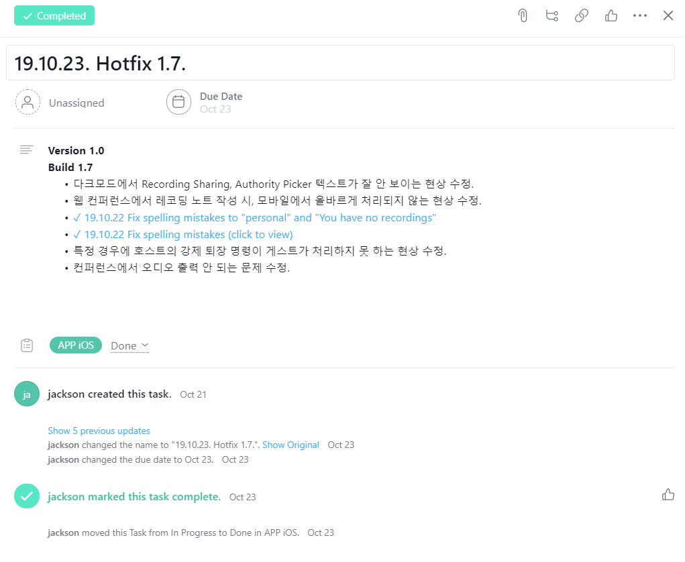
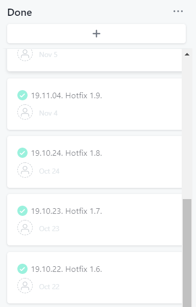

# iOS Software Engineer 김동현

## 소개
> ## 특징
> - 새로운 기술을 익히는데 관심 있어, 새로운 기술을 익히는데 두려움이 없습니다.
> - 모나지 않은 성격입니다.
> ## 주소
> - 서울특별시 관악구
> ## 연락처
> -  
> - 

## 능력
> ## Stack
> | Group | Tech |
> | ------------- | ------------- |
> | Platform  | iOS, Windows, Web |
> | Language  | Swift, Objective-C, C#, C++, Java, JavaScript |
> | IDE | Xcode, Visual Studio, Eclipse, Appcelerator |
> | SCM | Git(Sourcetree), SVN(SmartSVN), VSS(MS Visual SourceSafe) |
> | DBMS | Oracle, MS SQL Server, MySQL |
> | etc. | Asana, Trello, Postman, Figma, Sketch |
>
> ## iOS
> - App Store 배포 경험.
> - In-House 배포 경험.
> - Asynchronous(GCD, NSOperation) 사용 경험.
> - Networking(Socket, HTTP) 사용 경험.
> - TestFlight, App Store Connect 사용 경험.
> - Auto Layout with Storyboard 사용 경험.
> - Auto Layout with Code 사용 경험.
> - Open Source(Alamofire, SwiftyJSON, Kingfisher, AFNetworking, JSONModel, SDWebImage 등등) 사용 경험.
> - Open API(Google Sign-In, Facebook Account Kit, Naver Oauth, Naver Map, T map, KakaoNavi, NaverMap, KakaoPay 등등) 사용 경험.
>
> ## Windows
> - C#, .NET Framework, Oracle 중급.
> - C++, MFC, Oracle 중급.
>
> ## Web Back-end.
> - Java, Spring Framework, MS SQL Server, MySQL 초급.
>
> ## Web Front-end.
> - JavaScript, jQuery, HTML 초급.

## 경력
> 6년 7개월.
> ## (주)리니어허브
> - 2018.11 ~ 2019.11.
> - iOS App Developer
>
> ## (주)더함스토리
> - 2017.10 ~ 2018.09
> - iOS App Developer
>
> ## (주)장플레이스랩
> - 2016.10 ~ 2017.06
> - iOS App Developer
>
> ## (주)이센소프트
> - 2012.04 ~ 2016.04
> - iOS App Developer

## 프로젝트
> ## **Linearhub - Roundee**
> 
> 
> 
> 
> 
>
> - 2018.11 ~ 2019.11.
> - **Video Conferencing iOS Application**.
>   - 메인 개발자로서 설계, 개발 및 유지보수.
>   - [WebRTC](https://webrtc.org/)를 활용해 RTC(Real-Time Communications) 기능 구현.
>   - Signal 서버와 Signaling 기능 구현.
>   - TestFlight, [Asana](https://asana.com/?utm_source=unknown&utm_campaign=app.asana.com#close)를 활용해 내부 테스트 진행.
>
>     
>     
>     
>   - [AppStore](https://apps.apple.com/app/roundee-smart-video-meetings/id1477591585).
>
> ## **LOTTE Ecommerce - Roundee Framework**
> - 2018.11 ~ 2019.11.
> - **Video Conferencing iOS Framework**.
>   - 메인 개발자로서 설계, 개발 및 유지보수.
>   - [WebRTC](https://webrtc.org/)를 활용해 RTC(Real-Time Communications) 기능 구현.
>   - Signal 서버와 Signaling 기능 구현.
>   - **PasS** 프로젝트, Framework API 가이드라인 작성 및 제공.
>
> ## **HYUNDAI AutoEver - mTalk** 
> - 2018.11 ~ 2019.11.
> - **Enterprise Messenger iOS Application**.
>   - 서브 개발자로서 추가 개발 건 개발 및 유지보수.
>
> ## **DEOHAM - QURY**
> - 2018.03 ~ 2018.09.
> - **SNS iOS Application**.
>   - 메인 개발자로서 설계, 개발 및 유지보수.
>
> ## **HYUNDAI AutoEver - G-Line(GENESIS), H-Line(HYUNDAI)**
> - 2017.10 ~ 2018.09.
> - **Enterprise Messenger iOS Application**.
>   - 메인 개발자로서 추가 개발 건, 개발 및 유지보수.
>
> ## **OKBAN - 옥반식품** 
> - 2017.04 ~ 2017.06
> - **Shopping Mall Website**.
>   - Client 사이트 회원가입, 로그인, 회원탈퇴, 아이디 & 비밀번호 찾기, 휴면계정 페이지 Front-end & Back-end 개발 및 유지보수.
>   - Admin 사이트 일부 페이지 Front-end & Back-end 개발 및 유지보수.
>   - [Website](https://www.okban.co.kr/homepage)
>
> ## **ZLAB - ZLAB 홈페이지** 
> - 2017.02 ~ 2017.03
> - **Homepage Website**.
>   - Client 사이트 ABOUT US 페이지 Front-end & Back-end 개발 및 유지보수.
>   - Admin 사이트 일부 페이지 Front-end & Back-end 개발 및 유지보수.
>
> ## **AJ Park - AJ파크** 
> - 2016.10 ~ 2017.06
> - **Navigation iOS Application**.
>   - 메인 개발자로서 설계, 개발 및 유지보수.
>
> ## **CJ HELLO - Cablenavigator** 
> - 2013.01 ~ 2016.04
> - 광동축망 네트워크 관리 시스템(HFC NMS) **Enterprise Windows Application**. 
>   - 서브 개발자로서 추가 개발 건, 개발 및 유지보수.
>
> ## **CJ HELLO - CAMS** 
> - 2012.04 ~ 2016.04
> - 광동축망 네트워크 관리 시스템(HFC NMS) **Enterprise iOS Application**.
>   - 메인 개발자로서 설계, 개발 및 유지보수.
>
> ## **Essen - MaterialOrders** 
> - 2015.10 ~ 2016.04
> - 자재 발주 **Enterprise Windows Application**.
>   - 서브 개발자로서 추가 개발 건, 개발 및 유지보수.
>
> ## **Essen - HeadendDesigner** 
> - 2015.03 ~ 2015.08
> - HEADEND(헤드엔드), RACK(서버 랙) 설계 **Enterprise Windows Application**. 
>   - 메인 개발자로서 설계, 개발 및 유지보수.
>
> ## **Essen - ResourceMonitoring** 
> - 2014.05 ~ 2014.09
> - 서버 리소스 모니터링 **Enterprise Windows Application**.
>   - 메인 개발자로서 설계, 개발 및 유지보수.
