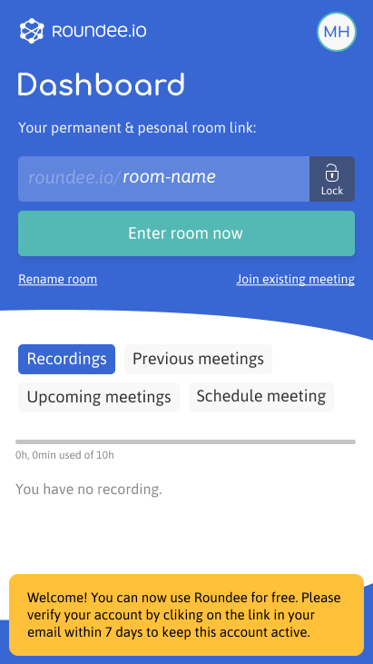
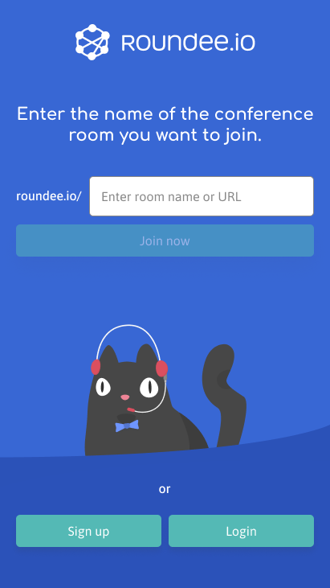
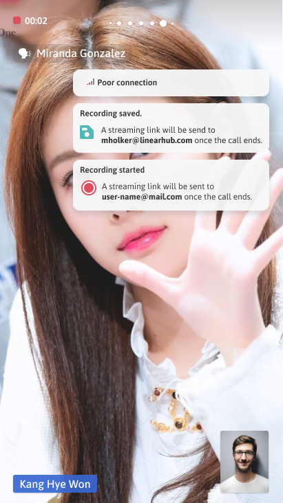
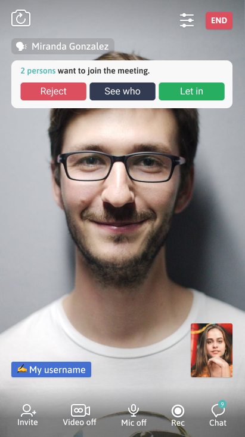
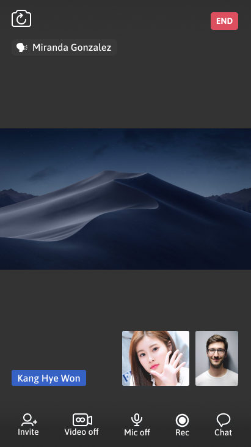

## iOS Software Engineer 김동현
### 특징
- 새로운 기술을 익히는데 관심 있습니다.
- 모나지 않은 성격입니다.
### 주소
- 서울특별시 관악구
### 연락처
-  
- 

## 능력
### Stack
| Group | Tech |
| ------------- | ------------- |
| Platform  | iOS, Windows, Web |
| Language  | Swift, Objective-C, C#, C++, Java, JavaScript |
| IDE | Xcode, Visual Studio, Eclipse, Appcelerator |
| SCM | Git(Sourcetree), SVN(SmartSVN), VSS(MS Visual SourceSafe) |
| DBMS | Oracle, MS SQL Server, MySQL |
| etc. | Postman, Asana, Notion, Trello, Figma, Zeplin |

### iOS
- Swift, Objective-C.
- VIPER, MVVM, MVP, MVC.
- App Store distribution, In-House distribution.
- TestFlight, App Store Connect.
- GCD, NSOperation Asynchronous.
- Socket, HTTP Networking.
- Open Source(Alamofire, SwiftyJSON, Kingfisher, AFNetworking, JSONModel, SDWebImage, etc..).
- Open API(Google Sign-In, Facebook Account Kit, Naver Oauth, Naver Map, T map, KakaoNavi, NaverMap, KakaoPay, etc..).
- Auto Layout with Storyboard, Auto Layout with Code.

### Windows
- C#, .NET Framework, Oracle.
- C++, MFC, Oracle.

### Web Back-end.
- Java, Spring Framework, MS SQL Server, MySQL.

### Web Front-end.
- JavaScript, jQuery, HTML.

## 경력
6년 7개월.
### (주)리니어허브
- 2018.11 ~ 2019.11.
- iOS App Developer

### (주)더함스토리
- 2017.10 ~ 2018.09
- iOS App Developer

### (주)장플레이스랩
- 2016.10 ~ 2017.06
- iOS App Developer

### (주)이센소프트
- 2012.04 ~ 2016.04
- iOS App Developer

## 이력
### **Linearhub - Roundee**
- 2018.11 ~ 2019.11.
- 소개.
  - **Video Conferencing iOS Application**.
  - WebRTC 기반, 화상회의 서비스.
- 역할.
  - 메인 개발자로서 설계, 개발 및 유지보수.
  - [WebRTC](https://webrtc.org/)를 활용해 RTC(Real-Time Communications) 기능 구현.
  - Signaling 기능 구현.
  - TestFlight, [Asana](https://asana.com/?utm_source=unknown&utm_campaign=app.asana.com#close)를 활용해 내부 테스트 진행.
  - [AppStore](https://apps.apple.com/app/roundee-smart-video-meetings/id1477591585) 배포.
  

### **LOTTE Ecommerce - Roundee Framework**
- 2018.11 ~ 2019.11.
- 소개.
  - **Video Conferencing iOS Framework**.
  - **PasS**, iOS API 서비스.
- 역할.
  - 메인 개발자로서 설계, 개발 및 유지보수.
  - [WebRTC](https://webrtc.org/)를 활용해 RTC(Real-Time Communications) 기능 구현.
  - Signaling 기능 구현.
  - 연동 규격 문서 작성.
  - 샘플 가이드라인 문서 작성.

### **HYUNDAI AutoEver - mTalk** 
- 2018.11 ~ 2019.11.
- 소개.
  - **Enterprise Messenger iOS Application**.
- 역할.
  - 서브 개발자로서 추가 개발 건 개발 및 유지보수.

### **DEOHAM - QURY**
- 2018.03 ~ 2018.09.
- 소개.
  - **SNS iOS Application**.
- 역할.
  - 메인 개발자로서 설계, 개발 및 유지보수.

### **HYUNDAI AutoEver - G-Line(GENESIS), H-Line(HYUNDAI)**
- 2017.10 ~ 2018.09.
- 소개.
  - **Enterprise Messenger iOS Application**.
- 역할.
  - 메인 개발자로서 추가 개발 건, 개발 및 유지보수.

### **OKBAN - 옥반식품** 
- 2017.04 ~ 2017.06
- 소개.
  - **Shopping Mall Website**.
- 역할.
  - Client 사이트 회원가입, 로그인, 회원탈퇴, 아이디 & 비밀번호 찾기, 휴면계정 페이지 Front-end & Back-end 개발 및 유지보수.
  - Admin 사이트 일부 페이지 Front-end & Back-end 개발 및 유지보수.
  - [Website](https://www.okban.co.kr/homepage)

### **ZLAB - ZLAB 홈페이지** 
- 2017.02 ~ 2017.03
- 소개.
  - **Homepage Website**.
- 역할.
  - Client 사이트 ABOUT US 페이지 Front-end & Back-end 개발 및 유지보수.
  - Admin 사이트 일부 페이지 Front-end & Back-end 개발 및 유지보수.

### **AJ Park - AJ파크** 
- 2016.10 ~ 2017.06
- 소개.
  - **Navigation iOS Application**.
  - 주차장 내비게이션.
- 역할.
  - 메인 개발자로서 설계, 개발 및 유지보수.

### **CJ HELLO - Cablenavigator** 
- 2013.01 ~ 2016.04
- 소개.
  - **Enterprise Windows Application**.
  - 광동축망 네트워크 관리 시스템(HFC NMS).
- 역할.
  - 서브 개발자로서 추가 개발 건, 개발 및 유지보수.

### **CJ HELLO - CAMS** 
- 2012.04 ~ 2016.04
- 소개.
  - **Enterprise iOS Application**.
  - 광동축망 네트워크 관리 시스템(HFC NMS).
- 역할.
  - 메인 개발자로서 설계, 개발 및 유지보수.

### **Essen - MaterialOrders** 
- 2015.10 ~ 2016.04
- 소개.
  - **Enterprise Windows Application**.
  - 자재 발주 서비스.
- 역할.
  - 서브 개발자로서 추가 개발 건, 개발 및 유지보수.

### **Essen - HeadendDesigner** 
- 2015.03 ~ 2015.08
- 소개.
  - **Enterprise Windows Application**.
  - HEADEND(헤드엔드), RACK(서버 랙) 설계 서비스.
- 역할.
  - 메인 개발자로서 설계, 개발 및 유지보수.

### **Essen - ResourceMonitoring** 
- 2014.05 ~ 2014.09
- 소개.
  - **Enterprise Windows Application**.
  - 서버 리소스 모니터링 서비스.
  - 관리 중인 서버들의 리소스(CPU, Memory, Disk, Netwrok) 상태를 기록, 대시보드로 제공.
- 역할.
  - 메인 개발자로서 설계, 개발 및 유지보수.
  - 관리하고 있는 많은 서버들의 리소스 상태를 간편하게 확인함으로써 관련 서버 유지보수에 있어 편리함 제공.
